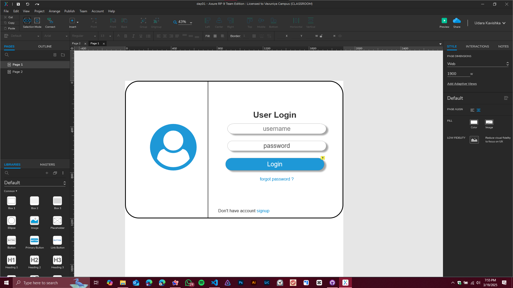
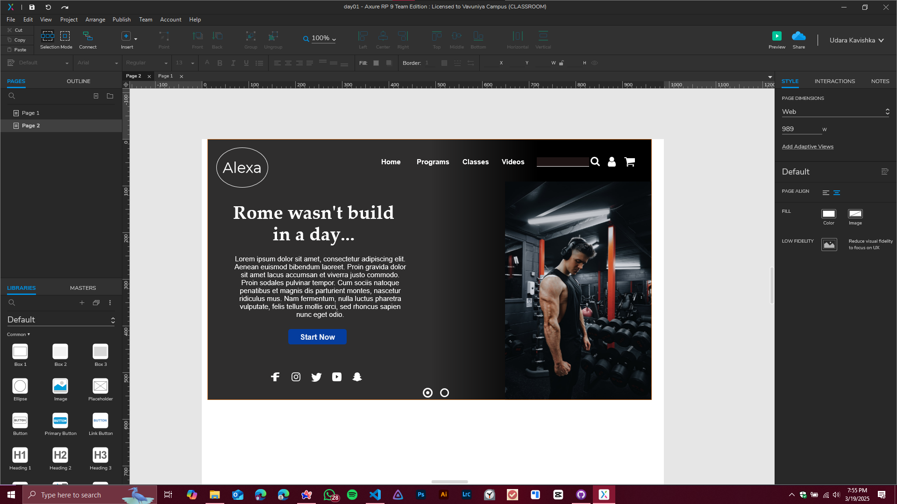

# Day 01 Practical Sessions - IT3213 Human Computer Interaction (HCI) 🖥️👤

This repository contains the practical work done in **Axure RP 9** for **Day 01** of the **IT3213 Human Computer Interaction (HCI)** course. The practical session consists of creating two interactive pages: a **Login Page** and a **Gym Website Page**. Below are the details of the practical work.

---

## Practical Overview 🛠️

### Page 01: Login Page 🔐
- **UI Elements:**
  -  Username field
  -  Password field
  -  Login button
  -  "Forgot Password?" link
  -  "Don't have an account? Sign Up" link

- **Interactions:**
  - Clicking the **Login button** navigates to **Page 02**.

#### Screenshot of Page 01:

---

### Page 02: Gym Website Page 🏋️‍♂️
- **UI Elements:**
  - **Navbar** with the following options:
    -  Home
    -  Programs
    -  Classes
    -  Videos
  -  Search bar
  -  User profile icon
  -  A **card** displaying gym-related information
  -  **Start Now** button
  -  Social media icons (e.g., Facebook, Instagram, Twitter)

#### Screenshot of Page 02:

---

## Hosted Project on Axure Cloud ☁️
The project has been hosted on **Axure Cloud** for easy access and interaction. You can view the live prototype by clicking the link below:

🔗 **[Axure Cloud Project Link](https://efm7bs.axshare.com)**  

---

## How to Use the Axure RP 9 File 📂
1. Download and install **Axure RP 9** if you haven't already.
2. Open the `.rp` file provided in this repository.
3. Navigate through the pages using the **Page Navigator** in Axure RP 9.
4. Preview the prototype by clicking the **Preview** button to see the interactions in action.

---

## License 📜
This project is licensed under the MIT License. See the [LICENSE](LICENSE) file for details.